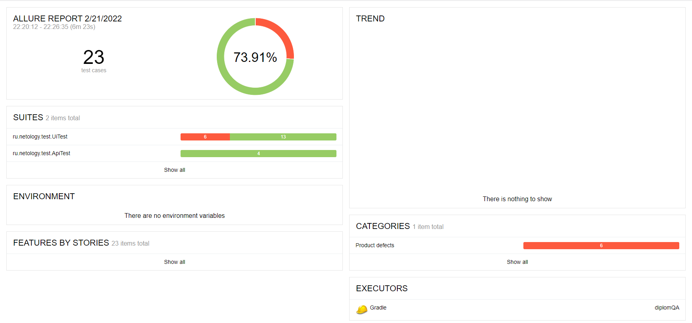
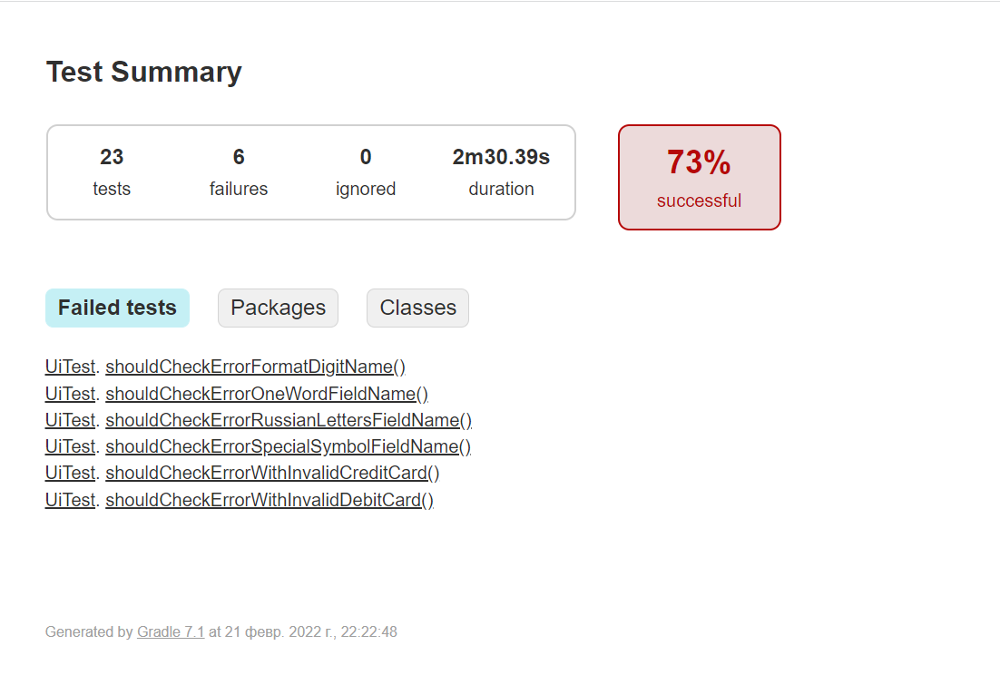

## Отчет по итогам тестирования

### Краткое описание

Протестирован веб-сервис (с СУБД и API) покупки тура двумя способами:
- по дебетовой карте;
- по выданному кредиту по данным банковской карты.

### Количество тест-кейсов

Проведено 23 тест-кейса из них 17 (73.91%) успешных и 6 (26,08%) не успешных.

#### Allure Report

#### Отчет Gradle 

### Общие рекомендации

1. Устранить баги.
2. Сделать какую-нибудь подсветку, чтобы было понятно, что кнопка активна для "Купить", "Купить в кредит".
3. Блокировать кнопку "Продолжить", пока хотя бы одно поле будет пустое.